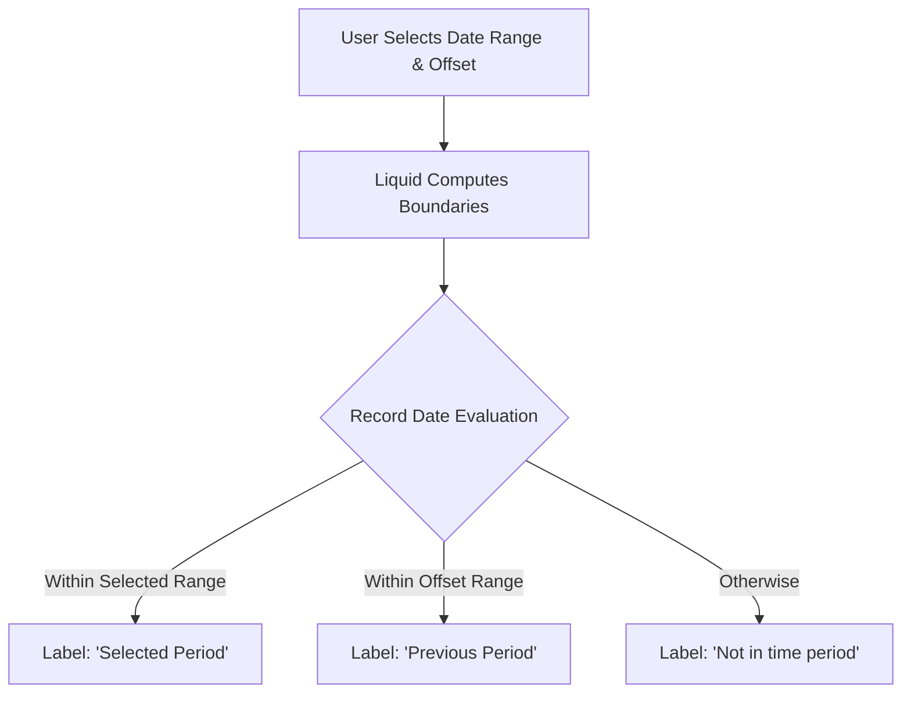

# Advanced Period-over-Period (PoP) Engine

This reference handbook details the standard pattern for implementing a high-performance, single-view Period-over-Period (PoP) engine in Looker. This pattern allows business users to dynamically compare metrics across flexible timeframes (e.g., Year-over-Year, Month-over-Month, Week-over-Week) without duplicating views or performing heavy database joins.

---

## 1. Core Architecture

The PoP engine relies on:
1.  A user-facing **Control Date Filter** where the user selects the "Current Period" range.
2.  A user-facing **Comparison Period Parameter** to select the offset (Yesterday, Week, Month, Year).
3.  Liquid-templated CASE WHEN logic that dynamically labels database records as `'Selected Period'`, `'Previous Period'`, or `'Not in time period'`.



---

## 2. LookML Implementation

Add these fields to your refined view file (e.g., `views/refined/orders_rfn.view.lkml`). Always place them in the `# PERIOD OVER PERIOD LOGIC` section at the top.

### Step 1: User Inputs (Filter & Parameter)
```lookml
# 1. The main date filter that controls the comparison
filter: pop_date_filter {
  view_label: "_PoP"
  label: "Comparison Date Filter"
  description: "Select the current date range to compare against the previous period."
  type: date
  default_value: "7 days"
}

# 2. Parameter to select the offset interval
parameter: pop_compare_to {
  view_label: "_PoP"
  label: "Compare To"
  description: "Select the offset interval for the previous period comparison."
  type: string
  allowed_value: { value: "Yesterday" }
  allowed_value: { value: "Week" }
  allowed_value: { value: "Month" }
  allowed_value: { value: "Year" }
  default_value: "Year"
}
```

### Step 2: Hidden Helper Dimensions
Define these hidden dimensions to calculate the date boundaries. Note that the date casting and date-addition logic must be adjusted based on your database dialect (see Section 3 for multi-dialect SQL).

```lookml
# Helper: Extract the raw date column from the database
dimension: pop_data_date {
  hidden: yes
  type: date
  sql: CAST(${TABLE}.created_at AS DATE) ;; # Adjust database column name accordingly
}

# Helper: Capture the start date of the user's filter
dimension_group: pop_filter_start {
  hidden: yes
  type: time
  timeframes: [raw, date]
  sql: CASE WHEN  IS NULL THEN '1970-01-01' ELSE CAST( AS DATE) END ;;
}

# Helper: Capture the end date of the user's filter
dimension_group: pop_filter_end {
  hidden: yes
  type: time
  timeframes: [raw, date]
  sql: CASE WHEN  IS NULL THEN CURRENT_DATE ELSE CAST( AS DATE) END ;;
}
```

---

## 3. Multi-Dialect SQL Implementations (Dialect-Agnostic)

Depending on your database warehouse, implement the appropriate boundary-calculation dimensions.

### Dialect A: Google BigQuery
```lookml
# Helper: Calculate the date difference (interval) of the selected range in days
dimension: pop_interval_days {
  hidden: yes
  type: number
  sql: DATE_DIFF(${pop_filter_end_date}, ${pop_filter_start_date}, DAY) ;;
}

# Helper: Calculate the starting boundary of the previous period
dimension: pop_previous_start_date {
  hidden: yes
  type: date
  sql: 
    DATE_SUB(${pop_filter_start_date}, INTERVAL 
       1 DAY
       1 WEEK
       1 MONTH
       1 YEAR
       ${pop_interval_days} DAY
      
    ) ;;
}
```

### Dialect B: Snowflake
```lookml
# Helper: Calculate the date difference (interval) of the selected range in days
dimension: pop_interval_days {
  hidden: yes
  type: number
  sql: DATEDIFF('day', ${pop_filter_start_date}, ${pop_filter_end_date}) ;;
}

# Helper: Calculate the starting boundary of the previous period
dimension: pop_previous_start_date {
  hidden: yes
  type: date
  sql: 
    DATEADD(
       'day', -1
       'week', -1
       'month', -1
       'year', -1
       'day', -${pop_interval_days}
      ,
      ${pop_filter_start_date}
    ) ;;
}
```

### Dialect C: Amazon Redshift & PostgreSQL
```lookml
# Helper: Calculate the date difference (interval) of the selected range in days
dimension: pop_interval_days {
  hidden: yes
  type: number
  sql: DATEDIFF(day, ${pop_filter_start_date}, ${pop_filter_end_date}) ;;
}

# Helper: Calculate the starting boundary of the previous period
dimension: pop_previous_start_date {
  hidden: yes
  type: date
  sql: 
    DATEADD(
       day, -1
       week, -1
       month, -1
       year, -1
       day, -${pop_interval_days}
      ,
      ${pop_filter_start_date}
    ) ;;
}
```

---

## 4. The Core Period Evaluator & Measures

Once the boundaries are calculated, define the period group dimension and the scorecard measures.

### The Period Group Dimension
This dimension categorizes every database row into a comparison category. This is the field users will drag into their pivots.

```lookml
# Evaluates which period group the record belongs to
dimension: pop_period_group {
  view_label: "_PoP"
  label: "Comparison Period"
  description: "Categorizes records into Selected Period, Previous Period, or Not in time period."
  type: string
  case: {
    when: {
      sql: ${pop_data_date} > ${pop_filter_start_date} AND ${pop_data_date} <= ${pop_filter_end_date} ;;
      label: "Selected Period"
    }
    when: {
      sql: ${pop_data_date} > ${pop_previous_start_date} AND ${pop_data_date} <= ${pop_filter_start_date} ;;
      label: "Previous Period"
    }
    else: "Not in time period"
  }
}
```

### Scorecard KPI Measures (Inheritance Compliant)
To build scorecard tiles showing current value, previous value, and percent change, write the following measures. Notice the strict use of the **Substitution Operator** (`${orders_count}`) to inherit properties and compile dependencies correctly, and **Safe Division** to prevent errors.

```lookml
# Base Measure (Defined in raw/refined views)
measure: orders_count {
  type: count
  label: "Orders Count"
  description: "Total number of orders."
}

# 1. Selected Period Measure
measure: orders_count_selected {
  view_label: "_PoP"
  label: "Orders Count (Selected Period)"
  description: "Total orders during the user-selected date range."
  type: count
  filters: [pop_period_group: "Selected Period"]
  sql: ${orders_count} ;; # INHERITS metadata from base measure
}

# 2. Previous Period Measure
measure: orders_count_previous {
  view_label: "_PoP"
  label: "Orders Count (Previous Period)"
  description: "Total orders during the previous comparison date range."
  type: count
  filters: [pop_period_group: "Previous Period"]
  sql: ${orders_count} ;; # INHERITS metadata from base measure
}

# 3. Percentage Change Measure (Safe Math & Ratio Compliant)
measure: orders_count_pop_change {
  view_label: "_PoP"
  label: "Orders Count PoP % Change"
  description: "Percentage change in orders between selected and previous periods."
  type: number
  value_format_name: percent_1
  sql: 1.0 * (${orders_count_selected} - ${orders_count_previous}) / NULLIF(${orders_count_previous}, 0) ;;
  html:
    
      <span style="color: #0F9D58;">▲ {{ rendered_value }}</span>
    
      <span style="color: #DB4437;">▼ {{ rendered_value }}</span>
     ;;
}
```

---

## 5. Development Checklist
- [ ] Inputs (`pop_date_filter`, `pop_compare_to`) are placed in the `_PoP` view label.
- [ ] Helper boundary dimensions are set to `hidden: yes` to prevent user confusion.
- [ ] Date additions and castings are written using the correct SQL dialect syntax.
- [ ] Measures utilize `${field_name}` substitution operators to inherit properties.
- [ ] Percent change measure utilizes safe division (`NULLIF` or `SAFE_DIVIDE`) to prevent database query crashes.
