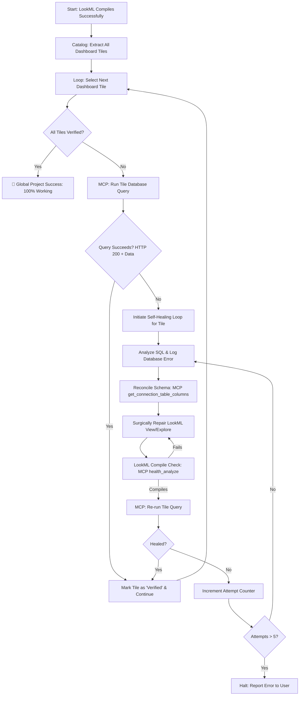

# SQL Runtime Debugging & Self-Healing Loop

This reference handbook details the **Generalized Self-Healing SQL Loop Protocol** using the Looker MCP server. 

Server-side LookML compilation (via `project validate` or `health_analyze`) only checks syntax and semantic integrity. It **does not** guarantee that the generated SQL queries will execute successfully on the target database. To ensure 100% functional dashboards, the AI agent must run execution-time query audits, capture database-specific errors, and surgically repair the LookML in place using an iterative, tile-by-tile self-healing loop.

---

## 1. The Generalized Self-Healing SQL Loop Protocol

When auditing or deploying any enterprise LookML project (Greenfield or Brownfield), the main AI agent and its subagents **MUST** execute the following systematic, dialect-agnostic loop.

### The Tile-by-Tile Iterative Loop Workflow:



---

### Step-by-Step Algorithm:

#### Phase 1: Tile Cataloging & Discovery
1.  **Parse Dashboard Files**: Read all LookML dashboard files (`.dashboard.lookml`) inside the `dashboards/` directory.
2.  **Catalog Visualization Elements**: Build a complete inventory of every visualization tile (`type: looker_line`, `type: single_value`, `type: looker_grid`, etc.) across all tabs. For each tile, record:
    *   The tile name and title.
    *   The model and explore it queries.
    *   The exact fields (dimensions, measures, filters) it utilizes.
    *   Its assigned `tab_name`.

#### Phase 2: Parallel Execution & Subagent Delegation
3.  **Spawn Subagents**: To optimize execution speed and prevent token bloat in the main conversation, the main agent **MUST** spawn a specialized subagent for each dashboard tab.
4.  **Batch Test Run**: Each subagent is responsible for running the queries for all tiles on its assigned tab.
    *   Execute queries using the Looker MCP tool `run_dashboard` (to test the tab in batch) or by calling `query` / `query_sql` for individual tiles.

#### Phase 3: The Iterative Diagnostics & Self-Healing Loop (Per Tile)
For every tile that fails to execute on the database (throwing a SQL or gRPC error), the subagent must initiate this self-healing loop:

5.  **Audit the SQL Statement and Database Error**:
    *   Extract the exact SQL statement generated by Looker.
    *   Log the exact error message returned by the database engine (e.g., column not found, type coercion mismatch, function signature error).
    *   Identify the LookML dimension, measure, or filter that generated the invalid SQL fragment.
6.  **Reconcile with Database Schema (MCP Schema Audit)**:
    *   If the database returns a "Column not found" or "Table not found" error, **DO NOT guess** the column names.
    *   Call the Looker MCP tool `get_connection_table_columns` passing the appropriate `connection_name` and `table_name`.
    *   Inspect the returned database schema to identify the *exact spelling and casing* of the physical columns.
7.  **Apply Dialect-Specific Corrections**:
    *   Surgically update the LookML view `sql:` mapping to match the correct database column.
    *   If the error is a function signature or type coercion mismatch (e.g., invalid date casting or string-to-timestamp comparison), rewrite the LookML expression to conform strictly to the target database dialect (see the Appendix for case studies).
    *   **Understanding Looker's Dialect Auto-Wrapping**: Looker's SQL generator automatically wraps dimensions of `type: date` or `type: time` in dialect-specific datetime conversion functions (such as `DATE()`, `TO_DATE()`, `DATETIME()`, or `CAST(... AS DATE)`).
        *   *Conflict*: If you write manual type casts inside the `sql:` parameter of a date dimension (e.g., `sql: CAST(${TABLE}.col AS DATE) ;;`), Looker's compiler will wrap it, producing redundant nested casts (e.g., `DATE(CAST(col AS DATE))`). In strict database engines, this redundant double-casting results in a signature crash (`No matching signature for function DATE`).
        *   *General Resolution*:
            1.  **For Timestamps**: If the physical database column is a `TIMESTAMP` (or a timestamp-compatible expression) and you want a `date` dimension, **do not** cast the column in your `sql:` parameter. Write `sql: ${TABLE}.column_name ;;` and let Looker apply its native wrapping function automatically.
            2.  **For Already-Date Columns (Coercion Hack)**: If the database column is already a `DATE` type and the database engine crashes due to double wrapping, you must coerce the SQL parameter inside `sql:` to a type that the dialect's automatic wrapper function natively accepts (e.g., casting a `DATE` column to a `TIMESTAMP` in the `sql:` parameter so that Looker's automatic `DATE()` wrap converts it back to a `DATE` safely: `sql: CAST(${TABLE}.date_col AS TIMESTAMP) ;;`).
8.  **Verify the Repair**:
    *   Run the Looker compiler (`health_analyze`) to ensure no LookML syntax errors were introduced.
    *   Re-execute the tile's query via Looker MCP.
    *   **Success Condition**: If the query returns a successful `HTTP 200` response with valid rows of data, mark the tile as **Healed & Verified** and proceed to the next tile.
    *   **Failure Condition**: If it still fails, increment the loop counter and repeat Phase 3.
    *   **Safeguard**: Limit the loop to **5 attempts per tile**. If a tile cannot be healed after 5 iterations, halt and report the exact error and SQL to the user.

#### Phase 4: Global Verification
9.  Once all tiles on all tabs are healed, run the global dashboard verification via MCP to confirm that the entire dashboard is 100% functional and error-free on the database.

---

## 2. Appendix: Dialect-Specific Case Studies & Examples

These case studies illustrate how to resolve common execution-time database errors using this protocol. Use them as templates when debugging similar dialect issues.

### Case Study A: Column Mapping Mismatch (Google Cloud Spanner)
*   **Error Intercepted**: `INVALID_ARGUMENT: Name query_text not found inside oldest_active_queries`.
*   **Reconciliation Plan**:
    1. The agent calls `get_connection_table_columns(connection_name: "spanner_conn", table_name: "oldest_active_queries")`.
    2. The schema returns that the physical column is named `text`, not `query_text`.
    3. The agent surgically updates the LookML mapping:
       ```lookml
       # Refactored LookML
       dimension: query_text {
         type: string
         label: "Query Text"
         sql: ${TABLE}.text ;; # Mapped to correct physical column
       }
       ```

### Case Study B: Strict Type Coercion & Function Signatures (Google Cloud Spanner)
*   **Error Intercepted**: `INVALID_ARGUMENT: No matching signature for function DATE. Argument types: DATE. Signature: DATE(TIMESTAMP, [STRING])`.
*   **Analysis**: The SQL statement contained `DATE(CAST(col AS DATE))`. In Spanner GoogleSQL, the `DATE()` function converts a `TIMESTAMP` or a `STRING` to a `DATE`. Passing a value that is already a `DATE` crashes the compiler.
*   **Reconciliation Plan**:
    The agent identifies that Looker's dialect generator automatically injects the `DATE()` wrapper around `type: date` dimensions. To resolve the signature crash, the agent applies the Dialect Auto-Wrapping Rule:
    1.  **If the source field is a TIMESTAMP (e.g., `interval_end` or `date_start`)**: Remove the manual `CAST(... AS DATE)` from the `sql:` parameter entirely, and let Looker wrap the raw timestamp natively:
        ```lookml
        # Refactored LookML (Correct Timestamp Mapping)
        dimension: interval_end {
          type: date
          sql: ${TABLE}.interval_end ;; # No manual cast! Looker compiles: DATE(interval_end)
        }
        ```
    2.  **If the source field is already a DATE in Spanner (Timestamp Coercion Hack)**: Cast the date column to a `TIMESTAMP` inside the `sql:` parameter. Looker's automatic `DATE()` wrapping will then safely compile into a valid signature:
        ```lookml
        # Refactored LookML (Timestamp Coercion Hack)
        dimension: pop_filter_start {
          type: date
          sql: CAST( AS TIMESTAMP) ;; # Coerced to TIMESTAMP! Looker compiles: DATE(CAST(... AS TIMESTAMP))
        }
        ```

### Case Study C: Safe Division & Math
*   **Error Intercepted**: Database query crashes due to `Division by zero` or returns `NULL` incorrectly.
*   **Reconciliation Plan**:
    1. The agent identifies that the denominator in a ratio measure can evaluate to zero.
    2. The agent surgically wraps the denominator in `NULLIF(..., 0)` or `SAFE_DIVIDE` to ensure mathematical safety:
       ```lookml
       # Refactored LookML
       measure: orders_pop_change {
         type: number
         value_format_name: percent_1
         sql: 1.0 * (${orders_selected} - ${orders_previous}) / NULLIF(${orders_previous}, 0) ;;
       }
       ```

---

## 3. Telemetry & Quality Assurance Checklist
- [ ] Catalog all dashboard tiles, fields, and explores before beginning the execution audit.
- [ ] Spawn a subagent per dashboard tab to parallelize query testing and refactoring.
- [ ] Intercept and log the exact SQL statement and database error for every failing tile.
- [ ] Call `get_connection_table_columns` to check database column spelling and types before editing LookML.
- [ ] Run the Looker compiler after every LookML edit to ensure zero syntax regressions.
- [ ] Verify that every dashboard tile executes successfully (HTTP 200 + data returned) on the database.
