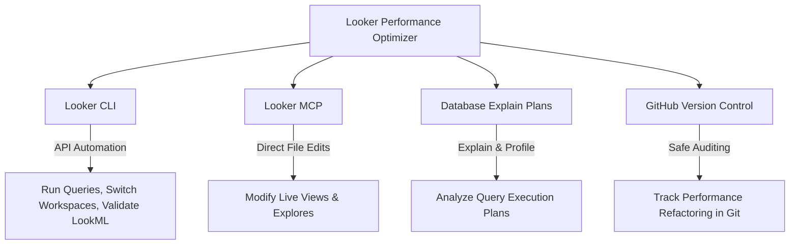

# Looker Performance Optimizer Skill

Welcome to the **Looker Performance Optimizer Skill** repository. This is a specialized developer skill designed for AI coding assistants (like Antigravity) and senior Looker developers to audit, diagnose, and optimize query performance in existing Looker projects.

Unlike scratch scaffolding, this skill focuses on **evaluating running Looker instances**, identifying bottlenecks, establishing caching/persistence strategies, and refactoring inefficient LookML.

---

## 1. What is the Looker Performance Optimizer?
This skill is a **macro-skill** containing a highly structured, 7-step diagnostic and optimization workflow. It bridges the gap between raw database performance (SQL execution) and Looker semantic modeling (LookML).

### The Specialized Reference Library
To execute performance tuning, the optimizer utilizes four specialized handbooks:
*   **[SKILL.md](SKILL.md)**: The master manual detailing the 7-step optimization workflow, diagnostic metrics, and optimization thresholds.
*   **[Query Diagnostics (references/query_diagnostic.md)](references/query_diagnostic.md)**: Guidelines for running diagnostic queries via the Looker CLI, analyzing SQL explain plans, and identifying bottlenecks like fan-outs, symmetric aggregations, and cross-joins.
*   **[Caching & Datagroups (references/caching_datagroups.md)](references/caching_datagroups.md)**: Caching alignment strategies, ETL-triggered datagroups, and persistency tuning.
*   **[PDT & Incremental Materialization (references/pdt_optimization.md)](references/pdt_optimization.md)**: PDT optimization standards, index/partition configurations, and transitioning to incremental materializations.
*   **[LookML Refactoring (references/lookml_refactoring.md)](references/lookml_refactoring.md)**: Field-level optimization, replacing liquid loops with native SQL, refactoring joins, and eliminating redundant calculations.

---

## 2. Connections and Stack Integration
This skill integrates with your local development tools and the live Looker instance to run automated diagnostics and deployments:

*   **Looker CLI (`looker-cli`):** Used to run tests, execute queries programmatically to measure performance, and validate refactored LookML against the server.
*   **Looker MCP:** Used by the AI agent to read and rewrite project files directly on the live Looker instance.
*   **Database Profile/Explain:** Analyzes the physical database execution path generated by Looker's SQL.

---

## 3. The 7-Step Optimization Workflow
The skill guides developers and AI agents through a strict, data-driven optimization lifecycle:
1.  **Discovery & Baseline:** Switch to dev mode and run baseline queries via Looker CLI to measure response times and query costs.
2.  **SQL Diagnostic Audit:** Extract the generated SQL and analyze the database execution plan (Explain Plan) to find physical bottlenecks.
3.  **Caching & Update Alignment:** Understand how often the source database tables update and align Looker's caching (datagroups) with the ETL pipeline.
4.  **PDT & Materialization Strategy:** Decide whether to materialize views into PDTs, rewrite slow PDT definitions, or implement incremental PDTs.
5.  **LookML Refactoring:** Clean up inefficient joins, resolve fan-outs, replace complex Liquid loops, and optimize fields.
6.  **Server Validation & Performance Testing:** Validate the LookML against the Looker server, and rerun the baseline queries to measure and document performance improvements.
7.  **Production Deployment:** Deploy the optimized code to production and document the performance delta for stakeholders.
