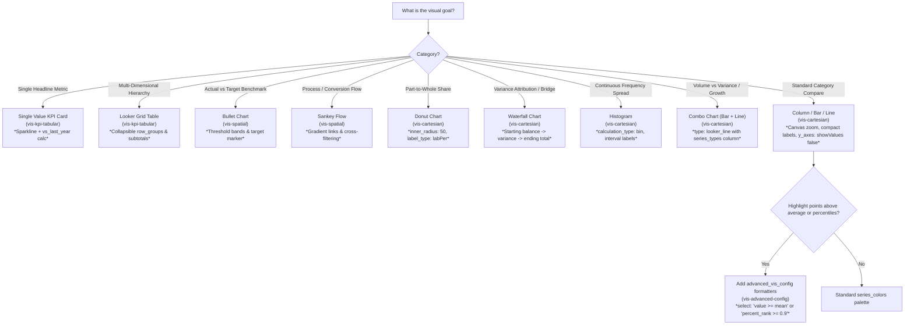

# Looker Visualisations Master Hub & Design Standards

This skill governs the selection, query shaping, and authoring of visualizations in LookML dashboards (`.dashboard.lookml`).

## Core Visual Design Principles (Mandatory)

Whenever generating or updating dashboard LookML, you **MUST** enforce these design standards:

### 1. Modern Style, Granular Grid & Performance Limits
* Always specify `preferred_viewer: dashboards-next` and `style: modern` at the dashboard level.
* Use `layout_granularity: granular` (72-column grid) to allow high-density placement.
* **Default to Half-Width Elements**: By default, aim for half-width (`width: 36` in the 72-column grid, allowing 2 side-by-side elements) for dashboard tiles unless a full-width header banner (`width: 72`) or wide table is required.
* **Standard Height**: Use a standard `height: 14` across all standard tiles (KPIs, charts, maps, and tables) for vertical rhythm and alignment.
* **Max 5 Tabs**: Limit tabbed dashboards to a maximum of 5 tabs (`tabs: [...]`) to maintain browser responsiveness and avoid cognitive overload. Tabbed dashboards strictly require `layout: newspaper`.
* **Tile Concurrency**: Keep tiles per tab under 20–25 for fast query execution.
* Set `modern2026: true` on every visualization element to enable Looker's updated rendering pipeline and modern theme tokens.

### 2. Mandatory Numeric Compaction & Currency Formatting
Never leave measures unformatted or display raw uncompacted numbers (e.g., `14829384.22`).
* Use conditional Excel-style compaction for KPI cards and headers:
  `value_format: '[>=1000000]0.0,," M";[>=1000]$0," K";0'`
* Use standard thousands abbreviation on axes and labels:
  `label_value_format: '$#,##0,"K"'` or `valueFormat: '$#,##0,"K"'`
* Format ratios and rates with explicit percentages: `value_format_name: percent_1`.

### 3. Explicit Value Labels & Decluttered Y-Axes
* Always evaluate `show_value_labels: true` on bar, column, bullet, and histogram charts so users can read data points without hovering.
* **Declutter Y-Axes**: If `show_value_labels: true` is added, it is not necessary to repeat values on the y-axis. Suppress redundant y-axis tick values by adding:
  ```yaml
  y_axes: [{showValues: false}]
  ```
* On Donut / Pie charts, set `value_labels: legend` and `label_type: labPer` so percentages are immediately visible.
* For headline KPIs, embed rich dark-mode tooltips using `global_tooltip_options` with Liquid template tags (`{{ view.field }}`).

### 4. Explicit Filter Binding (`listen:` Block)
Filters defined at the dashboard level do not automatically apply to tiles. Every data tile must explicitly connect to filters via a `listen:` block mapping filter names to explore fields.

---

## Progressive Disclosure: Sub-Skills Routing

Inspect user intent and route to the corresponding sub-skill file using `view_file`:

| Goal / Chart Type | Sub-Skill Path | What it Covers |
|---|---|---|
| **Layout, Tabs & Filters** | `vis-dashboards-modern/SKILL.md` | 72-col grid geometry, native `tabs: [...]` (max 5), buttons (`type: button`), `listen:` binding, banners |
| **KPIs & Modern Tables** | `vis-kpi-tabular/SKILL.md` | `single_value` with sparklines (`show_chart_component: true`), `looker_grid` with collapsible `row_groups` |
| **Cartesian & Comparisons**| `vis-cartesian/SKILL.md` | `looker_column`, `looker_bar`, `looker_line`, Combo charts, `looker_waterfall` (bridges), Histograms, Donut/Pie |
| **Spatial** | `vis-spatial/SKILL.md` | `looker_bullet` (targets/bands), `sankey` (gradient crossfilter), `looker_google_map` (transit layers) |
| **Advanced Config** | `vis-advanced-config/SKILL.md` | Declarative `formatters` (`value >= mean`, percentiles, categories), benchmark `reference_lines` |

---

## Visual Decision Tree



---

## Query Shape Validation Matrix

Before generating LookML, verify that the query fields match the visualization type:

| LookML `type` | Dimensions | Measures | Max Recommended Rows | Key 2026 Flags |
|---|---|---|---|---|
| `single_value` | 0 - 1 (time/dim) | 1 - 2 (KPI + compare) | 1 - 2 (or 50 with sparkline) | `show_chart_component: true`, `modern2026: true` |
| `looker_grid` | 1 - 50 | 0 - 50 | 5,000 | `row_groups.enabled: true`, `table_theme: modern` |
| `looker_column` / `looker_bar` | 1 | 1 - 10 | 50 | `x_axis_zoom: true`, `y_axes: [{showValues: false}]` |
| `looker_line` (Combo) | 1 (time/dim) | 2 - 5 (volumes + diff) | 50 | `series_types: { measure: column }`, `point_style: circle_outline` |
| `looker_waterfall` | 1 (stage/category) | 1 (delta change) | 20 | `up_color`, `down_color`, `total_color` |
| `looker_histogram` | 0 - 1 (binned) | 1 (continuous) | 5,000 | `calculation_type: bin`, `binWidth: 10` |
| `looker_bullet` | 1 | 1 - 3 | 50 | `bullet_range_limits_enabled: true`, `bullet_target` |
| `sankey` | 2 (Source, Target) | 1 (Volume) | 50 | `crossfilter_by: both`, `link_color_mode: gradient` |
| `looker_google_map` | 1 (`location`/`country`) | 1 - 2 | 5,000 | `map_marker_radius_mode: proportional_value` |
| `type: button` | 0 | 0 | N/A | `button_text`, `url`, `color` |
